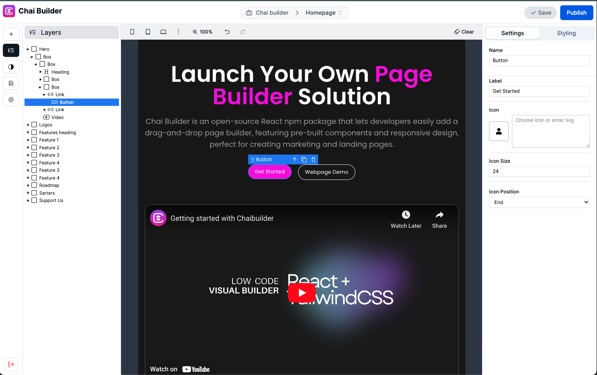

Chai Builder is an open-source React & Tailwind CSS based library that lets developers easily add a drag-and-drop page builder, featuring pre-built components and responsive design, perfect for creating marketing, landing pages & email templates

Seamlessly integrate with any framework or platform that supports ReactJS.
- ReactJS
- NextJS
- Gatsby
- Astro
- Remix

Chai Builder exposes 3 components for you to use:

- **`ChaiBuilderEditor`**: The main editor component that allows you to drag and drop components to build your page.
- **`ChaiBuilderStudio`**: The studio component allows your to build an entire websites with multiple pages and global settings
- **`ChaiBuilderEmail`**: The email component allows you to build email templates with drag and drop components

